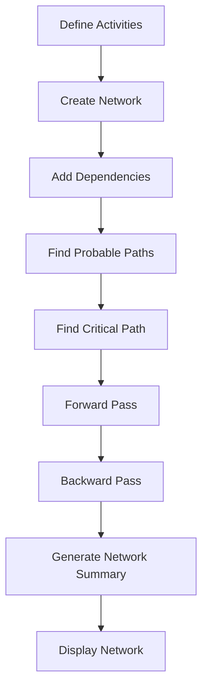
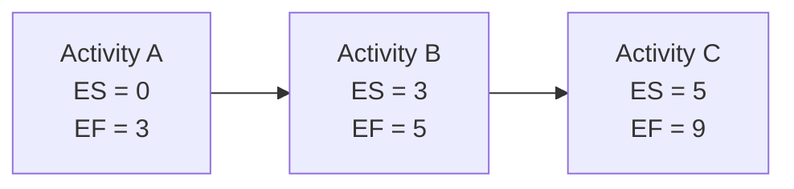
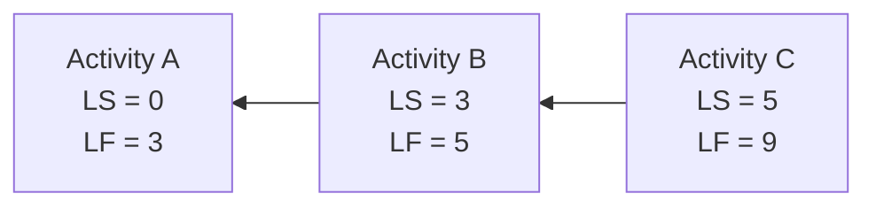
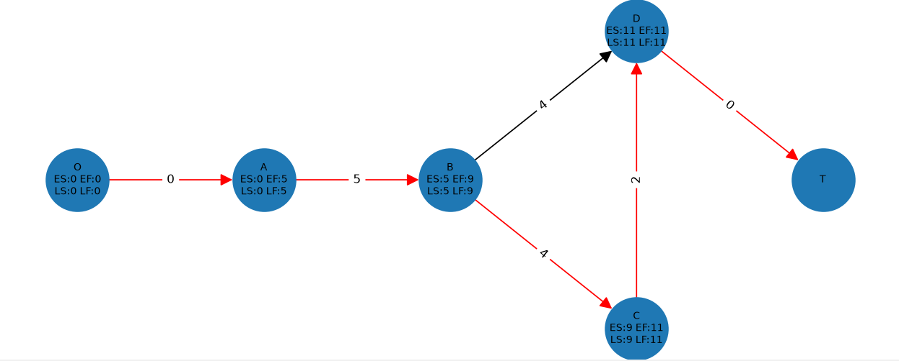
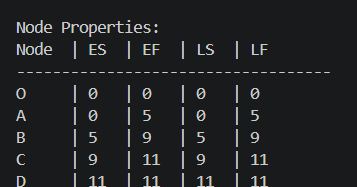

# NetworkDiagram

A lightweight Python library for creating Project Network Diagrams (CPM/PERT), calculating paths, and visualizing activity dependencies using NetworkX and Matplotlib.


## Features

* **Easy Node Management**: Add activities with durations and string-based predecessor lists (e.g., `"A,B"`).
* **Automatic Pathfinding**: Detects all probable paths from Start to End.
* **CPM Ready**: Built on a node structure supporting Probable Paths, Critical Path, and ES/EF/LS/LF attributes.
* **Forward & Backward Pass**: Automatically calculates Early Start (ES), Early Finish (EF), Late Start (LS), and Late Finish (LF) for all nodes.
* **Visualization**: Generates directed graphs with arrows and duration labels using `matplotlib`.

## Publisher

* **Name**: Kathan Majithia
* **Contact**: [kathanmajithia@gmail.com](mailto:kathanmajithia@gmail.com)

## Dependencies

To use the visualization features, you must have the following libraries installed:

* `networkx`
* `matplotlib`

## Installation

You can install the package directly via pip:

```bash
pip install networkdiagram
```

## Quick Start Guide

Here is a complete example of how to use the `networkdiagram` library to build a Critical Path Method (CPM) diagram, calculate properties, and visualize the output.

```python
from networkdiagram import CriticalPathMethod

# 1. Initialize the CPM Network
cpm = CriticalPathMethod()

# 2. Define Activities
activities = ['A', 'B', 'C', 'D']
durations = [0, 2, 5, 4, 2]
predecessors = ['-', 'A', 'B', 'B,C']

# 3. Add Origin and Activities to the Network
cpm.add_activity('O', 0)
cpm.add_activities_relations(activities, durations, predecessors)

# 4. Perform Path Calculations
cpm.find_probable_paths()
cpm.find_critical_path()

# 5. Calculate Early & Late Start/Finish
cpm.forward_pass()
cpm.backward_pass()

# 6. Generate Network Summary
cpm.network_summary()

# 7. Visualize the Network
cpm.get_edges()
cpm.display_network()
```

## CPM Calculation Workflow

The following workflow illustrates how NetworkDiagram processes activities and computes CPM metrics.



## Forward Pass Calculation

The Forward Pass calculates the earliest possible start and finish times for each activity in the network.

### Formula

```text
ES = Maximum EF of predecessor activities
EF = ES + Duration
```

### Visual Example



## Backward Pass Calculation

The Backward Pass calculates the latest possible start and finish times without delaying the project.

### Formula

```text
LF = Minimum LS of successor activities
LS = LF - Duration
```

### Visual Example



## Example Network Diagram



*Example network diagram generated using NetworkDiagram.*

## Network Summary



*Network summary generated after performing CPM calculations.*

## Practical Examples

### Example 1: Simple Project Network

The Quick Start Guide demonstrates a simple CPM network consisting of a few activities and dependencies.

#### Expected Output

* Generates a project network diagram.
* Identifies the critical path.
* Computes Early Start (ES) and Early Finish (EF).
* Computes Late Start (LS) and Late Finish (LF).
* Produces a network summary.

### Example 2: Intermediate Project Network

Suitable for projects with multiple dependencies and branching paths.

#### Expected Output

* Handles multiple activity dependencies.
* Identifies the critical path.
* Computes CPM metrics.
* Generates a visual project network.

### Example 3: Complex Project Network

Suitable for larger project schedules with several parallel paths.

#### Expected Output

* Supports larger project structures.
* Displays multiple probable paths.
* Highlights the critical path.
* Provides complete scheduling analysis.

## Accessing Node Properties

After running the forward and backward passes, each activity node will have its CPM properties populated. You can access these programmatically:

```python
node_a = cpm.nodes['A']

print(f"ES: {node_a.early_start}, EF: {node_a.early_finish}")
print(f"LS: {node_a.latest_start}, LF: {node_a.latest_finish}")
```

## Contributing

We welcome contributions!

1. Please read our `CONTRIBUTING.md` for detailed guidelines.
2. Ensure you are assigned to an issue before submitting a Pull Request.
3. PRs must be submitted against the `main` branch.
4. If modifying mathematical logic, please ensure you verify your algorithms against known project networks.

## License

This project is licensed under the MIT License.
